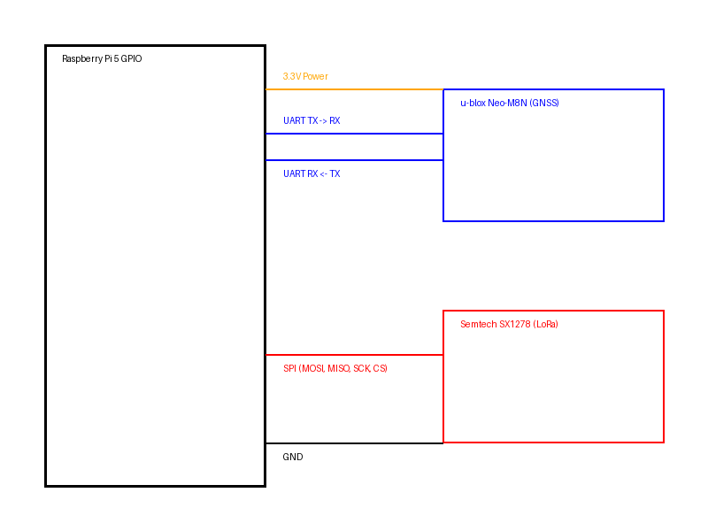

# SokolLightHouse Project


SokolLightHouse is an autonomous emergency positioning system designed for personal and light aviation use. It integrates GNSS positioning with LoRa-based telemetry transmission.

## Documentation

- [**Assembly Instructions**](assembly_instructions.md) - Full hardware setup and wiring guide.
- [**Legal Disclaimer (RU)**](legal/DISCLAIMER.ru.md) - Юридическая информация и отказ от ответственности.

## Project Structure

- **/firmware**: High-priority C++ system service for Raspberry Pi 5.
- **/os**: Customized Alpine for SAR (Search and Rescue) OS configuration.

## System Architecture

1.  **Operating System**: Alpine for SAR (RAM-only, diskless).
2.  **Hardware**:
    - **Processing Unit**: Raspberry Pi 5 (Cortex-A76).
    - **Positioning**: u-blox NEO-M8N GNSS (UART /dev/ttyAMA0).
    - **Transmission**: Semtech SX1278 LoRa (SPI /dev/spidev0.0).

## Repository Content

### firmware/
The core logic implemented as a high-performance C++ system service.
- Real-time NMEA parsing.
- ARMv8-A Optimized CRC-16 Calculation (Assembly).
- Low-level SPI control for SX1278 transceiver.

### os/
Specialized Alpine Linux distribution optimized for the ARMv8-A architecture.
- Hardened kernel with non-essential drivers disabled.
- Read-Only squashfs with ZRAM logging.

## Installation and Build

### 1. Build the firmware
```bash
cd firmware
make ARCH=armv8-a OPTIMIZE=-O3
```

### 2. Build the OS image
```bash
cd os
make iso
```

## Hardware Pinout Diagram

Below is the connection scheme for the Raspberry Pi 5, GNSS, and LoRa modules:



## Legal Disclaimer

This software is a technical prototype for educational and research purposes. It is NOT a certified Emergency Locator Transmitter (ELT). For full legal terms, please refer to the [Legal Disclaimer](legal/DISCLAIMER.ru.md).
